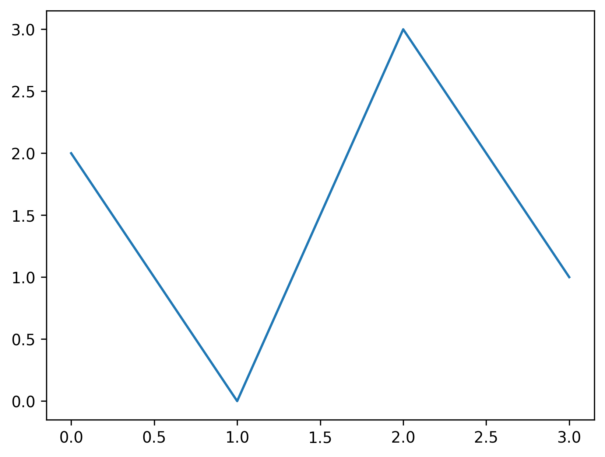
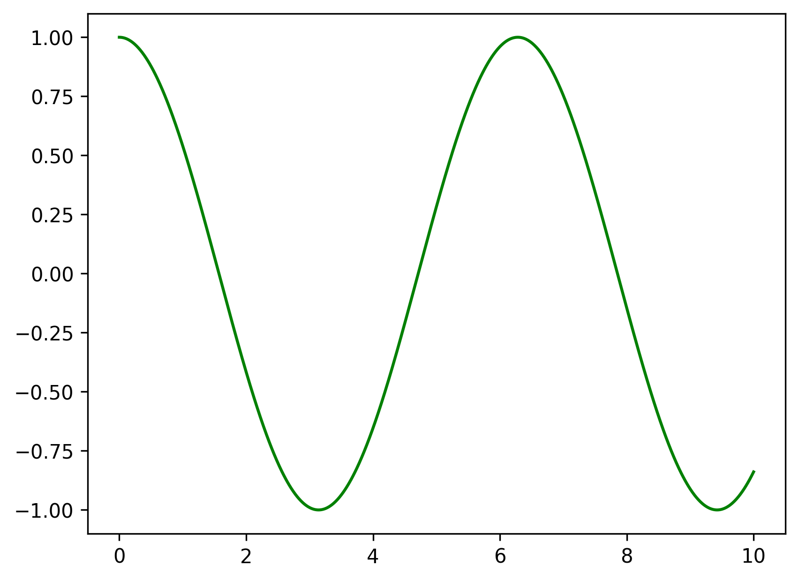
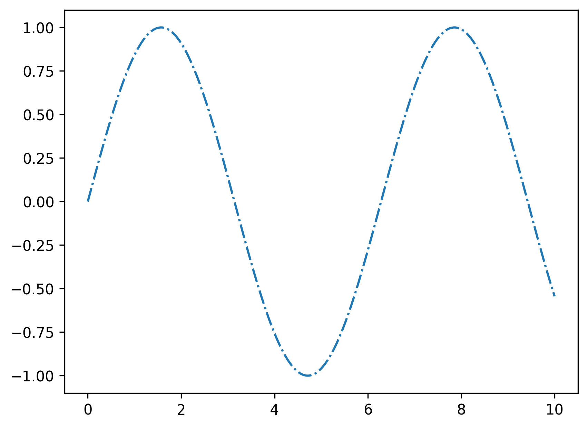
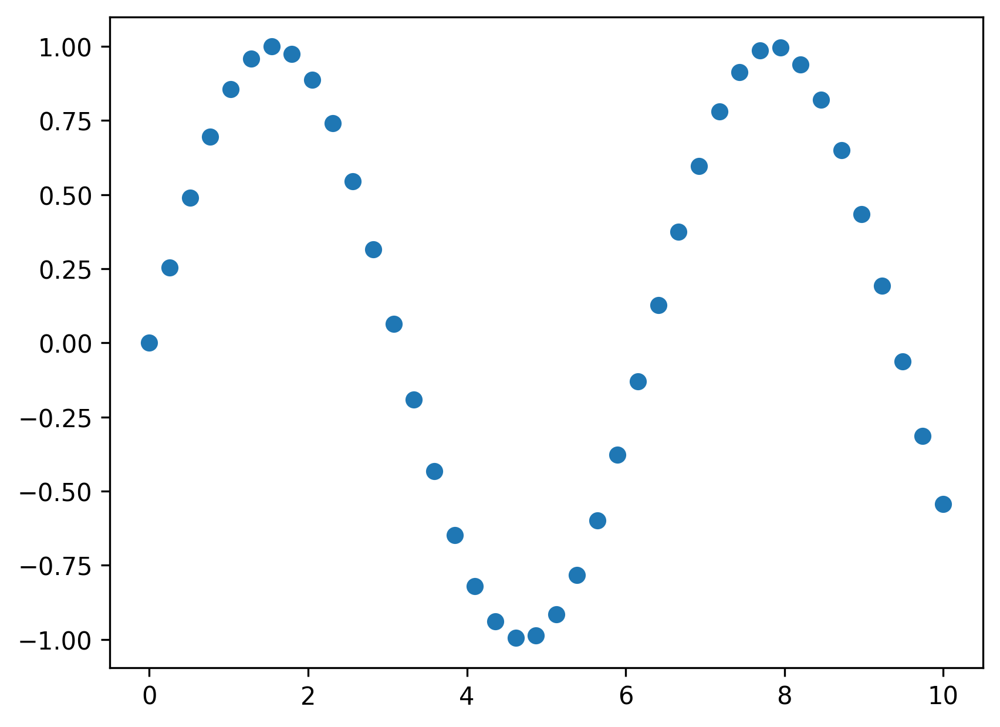
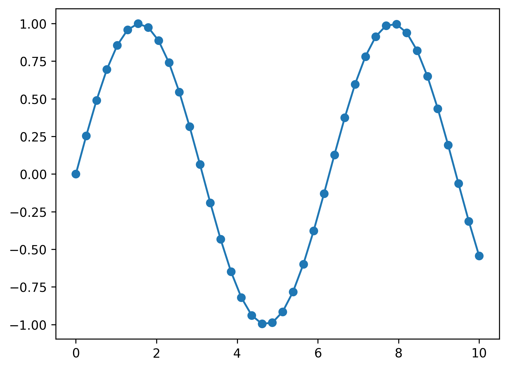

# Dictionary

| 日文 | 中文 | 解析 |
| --- | --- | --- |
| エキスパートシステム | 专家系统 |　特定の専門分野における人間の専門知識や判断プロセスをコンピュータに模倣させ、問題解決を支援する人工知能（AI）システムです。 |
| ディープラーニング（深層学習）　| 深层学习 |　人間の脳の神経回路を模した「ニューラルネットワーク」を多層的に（深く）重ね、大量のデータから複雑な特徴やパターンをAI自身が自動で学習する機械学習の手法です。 |
| 機械学習 | 机械学习 | コンピューターが大量のデータからパターンやルールを自動で学習し、その知識を使って未知のデータを予測・分類・判断する技術で、AI（人工知能）を実現する中核技術の一つです。 |
| 学習 | 学习 | 実際に手作業などで集めたデータを基に、機械学習のアルゴリズムに対して特徴量を抽出できるようにするステップです。 |
| 推論 | 推理 | データを使って学習させた機械学習のアルゴリズムを、学習に使ったデータにはなかった未知のデータに対してアルゴリズムを適用するステップです。 |
| 教師あり学習 | 监督学习 | 正解（ラベル）が付いたデータ（教師データ）を使ってAIモデルを訓練し、未知のデータに対して正しい予測や分類ができるようにする機械学習の手法です。 |
| 教師なし学習 | 无监督学习 | 正解ラベル（教師データ）がないデータから、AIが自らパターンや構造を発見する機械学習手法です。 |
| 強化学習 | 强化学习 | AI（エージェント）が環境との相互作用を通じて試行錯誤を繰り返し、長期的に報酬（スコア）を最大化する最適な行動戦略（方策）を自律的に学習する機械学習手法です。 |
| 過学習　| 过拟合 | 機械学習モデルが訓練データに過剰に適合し、ノイズまで学習してしまい、訓練データでの精度は非常に高いのに未知のデータ（テストデータ）では精度が低下する現象です。 |
| 汎化性能 | 泛化能力 | 機械学習モデルが学習に使ったデータ（訓練データ）だけでなく、それまで見たことのない新しいデータに対しても、どれだけ正確に予測・判断できるかという能力のことです。 |
| 標本化 | 采样 | 連続的に変化するアナログ情報（音や光など）を、一定の時間間隔や空間的区切りで計測・抽出して、離散的なデジタルデータに変換するプロセスです。 |
| 量子化 | 量化 | デジタル信号を非常に正確な形式から、より少ないスペースに変換するプロセスであり、その結果、精度が若干低下します。 |
| MNIST（エムにスト）| MNIST | 画像データセット |
| コンペ | 竞赛 | 「競技会」「競争」「コンテスト」を意味する。 |
| ILSVRC | ILSVRC | ImageNetとよばれる大規模（Large Scale）なデータセットを用いた画像（Visual Recognition）のコンペ（Challenge）でした。 |
| CNN（Convolutional Neural Network） | 卷积神经网络 | 畳み込みニューラルネットワーク |
| ニューラルネットワーク（Neural Network） | 神经网络 | 人間の脳の神経回路を模倣した機械学習モデルで、ノード（人工ニューロン）が層状に接続され、データからパターンを学習・認識・予測する技術です。 |
| SVM（サポートベクターマシン） | 支持向量机 | データを最もよく分離する「超平面（境界線）」を見つける教師あり機械学習アルゴリズムで、分類や回帰に使われ、特に少ないデータで高い精度を出すのが特徴です。 |
| ニューロン | 神经元 | 様々な情報や刺激等を伝達している神経細胞です。 |
| シナプス | 突触 | ニューロンとニューロンを繋ぐ接触部分です。 |
| 重み（weight） | 权重 | 入力されたデータに<br>それぞれ 重み をかけて計算します<br>重みが大きいほど、影響が強い<br>重みが小さいほど、影響が弱い |
| 順伝播 | 顺传播 | ニューラルネットワークにおいて入力層から出力層への方向を順方向として入力変数とパラメータをかけ合わせて予測値を計算することを指します。 |
| 逆伝播 | 逆传播 | ニューラルネットワークの学習において、出力層で生じた「予測値と正解のズレ（誤差）」を、入力層に向かって逆向きに伝えていくアルゴリズムです |
| バイアス（Bias） | 偏置 | バイアスはｘと重みｗで合算された値ｘｗに加えます。 |
| 平均二乗誤差(Mean Squared Error, MSE) | 平均二乘误差 |  |
| 誤差逆伝播法（バックプロパゲーション） | 误差反向传播法 | ニューラルネットワークが学習する際に、出力結果と正解との誤差を出力層から入力層へ逆向きに伝播させ、その誤差を小さくするようにネットワーク内の重みやバイアスを自動で調整するアルゴリズムです。 |
| 定数 | 常量 |  |
| 変数 | 变量 |  |
| 極限 | 极限 | 極端な値を表現するためのツールです。 |
| 微分 | 微分 | 求める値と実現の値の差を考えた誤差関数の最小値を求める勾配降下法など利用します。 |
| ベクトル | 向量 | vector 矢印 |
| 行列（matrix） | 矩阵 | 数や記号や式などを縦と横に矩形状に配列したものである。 |
| 集合 | 集合 |  |
| ベン図（Venn diagram）　| 韦恩图 |  |
| 和集合 | 并集 | A または B |
| 積集合 | 交集 | A かつ B |

---
---

# 数式

## シグモイド 関数
- sigmoid
$$P(a \leqq X < b) = \int_{a}^{b} f(x) dx$$
- 微分
$$\frac{d}{dx} \varsigma_{a}(x) = \frac{d}{dx} \left( \frac{1}{1 + e^{-ax}} \right) = \frac{ae^{-ax}}{(1 + e^{-ax})^{2}}$$
$$\frac{d}{dx} \varsigma_{a}(x) = \varsigma_{a}(x) (1 - \varsigma_{a}(x))$$

## 平均二乗誤差
- Mean Squared Error, MSE 
- 平均二乘误差
$$MSE = \frac{1}{N} \sum_{n=1}^{N} (x_n - k_n)^2 = \frac{1}{N} \| \mathbf{x_n} - \mathbf{k_n} \|^2$$


## アタマール積 
- 阿达马乘积
$$\mathbf{A} \odot \mathbf{B} = [a_{ij} \cdot b_{ij}]$$

## 微分の定義
$$\frac{d}{dx}f(x) = f'(x) = \lim_{\Delta x \to 0} \frac{f(x+\Delta x)-f(x)}{\Delta x}$$

## 連鎖率
- chain rule
- 链式法则
$$\begin{cases} y = f(u) \\ u = g(x) \end{cases} \quad \frac{dy}{dx} = \frac{dy}{du} \times \frac{du}{dx}$$

## 偏微分
- **对 $x$ 的偏导数：**
$$\frac{\partial f}{\partial x} = \lim_{\Delta x \to 0} \frac{f(x+\Delta x, y) - f(x, y)}{\Delta x}$$

- 复合函数偏导（链式法则一般式）
$$\frac{\partial z}{\partial x} = \frac{\partial z}{\partial u} \frac{\partial u}{\partial x} + \frac{\partial z}{\partial v} \frac{\partial v}{\partial x}$$


## 内積
$$\mathbf{a} \cdot \mathbf{b} = (a_1, a_2) \cdot \begin{pmatrix} b_1 \\ b_2 \end{pmatrix} = a_1 b_1 + a_2 b_2$$

## L1ノルム
- L1 范数
$$\|\mathbf{x}\|_1 = \sum_{i=1}^{n} |x_i|$$

## L2ノルム
- L2 范数定义
$$\|\mathbf{x}\|_2 = \sqrt{\sum_{i=1}^{n} x_i^2}$$

## 行列の積 
- 矩阵乘法
$$\begin{pmatrix} a_{11} & a_{12} \\ a_{21} & a_{22} \end{pmatrix} \begin{pmatrix} b_1 \\ b_2 \end{pmatrix} = \begin{pmatrix} a_{11}b_1 + a_{12}b_2 \\ a_{21}b_1 + a_{22}b_2 \end{pmatrix}$$

## アタマール積
- Hadamard 积
$$A \odot B = \begin{pmatrix} a_{11} & a_{12} \\ a_{21} & a_{22} \end{pmatrix} \odot \begin{pmatrix} b_{11} & b_{12} \\ b_{21} & b_{22} \end{pmatrix} = \begin{pmatrix} a_{11}b_{11} & a_{12}b_{12} \\ a_{21}b_{21} & a_{22}b_{22} \end{pmatrix}$$

## 単位行列
- 单位矩阵
- Identity Matrix
$$E = \begin{pmatrix} 1 & 0 \\ 0 & 1 \end{pmatrix}$$


## 逆行列
- Determinant
- 逆矩阵公式
- 当 $ad - bc \neq 0$ 时，A 的逆矩阵存在。
$$A^{-1} = \frac{1}{ad - bc} \begin{pmatrix} d & -b \\ -c & a \end{pmatrix}$$

## 固有値
- 特征值
- 对于正方形矩阵 A，如果存在非零向量 x 和常数 k，使得下式成立，则 k 为特征值，x 为特征向量：
#### 定义式
$$A\mathbf{x} = k\mathbf{x}$$
#### 特征方程
$$\det(A - kE) = 0$$
#### 2x2 展开式
$$\det \begin{pmatrix} a-k & b \\ c & d-k \end{pmatrix} = 0$$

## サラスの公式
- 三阶行列式（沙路公式）
$$\begin{vmatrix} a & b & c \\ d & e & f \\ g & h & i \end{vmatrix} = aei + bfg + cdh - (afh + bdi + ceg)$$

## 補集合 絶対補
$$ \bar{A}$$


## 相対補
- A 中 B 的相对补集
$$A \cap \bar{B}$$


## Permutation
- 排列
$${}_n \mathrm{P}_r = n(n-1)(n-2) \dots$$

## Combination
- 组合
$${}_n C_r = \frac{{}_n P_r}{r!}$$

## 確率密度関数
- 古典概率（Theoretical Probability）
$$P(A) = \frac{n(A)}{n(U)} = \frac{\text{A が起こる場合の数}}{\text{起こり得る全ての場合の数}}$$

## 正規分布
$$P(a \leqq X < b) = \int_{a}^{b} f(x) dx$$

---
---

# Python

## Numpy

```python
# Numpy
import numpy as np
A = np.random.randint(0, 10, (4, 5))
# [[6 7 3 6 5]
#  [2 3 1 0 2]
#  [7 2 8 7 1]
#  [0 5 1 3 4]]

np.array([1, 2, 3])
# array([1, 2, 3])

np.array([1, 7, 3]. [0, 5, 2])
# array([[1, 7 ,3], 
#        [0, 5, 2]])

x = np.array([1, 2])
w = np.array([[3, 4], [5, 6]])
x.dot(w)  # x@w
# array([13, 16])

np.zeros(5, dtype=int)
# array([0, 0, 0, 0, 0])

np.zeros(5)
# array([0., 0., 0., 0., 0.])

np.zeros((3, 5), dtype=int)
# array([[0, 0, 0, 0, 0],
#        [0, 0, 0, 0, 0],
#        [0, 0, 0, 0, 0]])

np.ones((3, 5), dtype=int)
# array([[1, 1, 1, 1, 1],
#        [1, 1, 1, 1, 1],
#        [1, 1, 1, 1, 1]])

np.full((3, 4), 3.14)
# array([3.14, 3.14, 3.14, 3.14],
#       [3.14, 3.14, 3.14, 3.14],
#       [3.14, 3.14, 3.14, 3.14])

np.full((3, 4), 3.14, dtype=int)
# array([3, 3, 3, 3],
#       [3, 3, 3, 3],
#       [3, 3, 3, 3])

np.arange(0, 20, 3)
# array([0, 3, 6, 9, 12, 15, 18])

np.linspace(0, 1, 5)
# array([0.  , 0.25, 0.5 , 0.75, 1.  ])

np.random.random((3, 4))
# array([[0.21082511, 0.34469919, 0.09241394, 0.51181511],
#        [0.30194158, 0.37104436, 0.71313691, 0.57343331],
#        [0.25022096, 0.94463827, 0.64323171, 0.5783137 ]])

np.random.normal(0, 1, (3, 3)) # 正規分布
# array([[ 0.83653979, -1.68384113, -0.25594206],
#        [-0.06730962,  0.83811729, -1.55179533],
#        [-0.48725694, -0.5332726 ,  0.28345037]])

np.random.randint(0, 20, (3, 4))
# array([[ 7, 17, 10,  7],
#        [ 4,  8, 10, 16],
#        [ 7,  4, 17,  5]])

np.eye(4) # 単位行列
# array([[1., 0., 0., 0.],
#        [0., 1., 0., 0.],
#        [0., 0., 1., 0.],
#        [0., 0., 0., 1.]])


```

## Skiti-learn

```python
from sklearn import datasets
digits = datasets.load_digits()
digits['target']
# array([0, 1, 2, ..., 8, 9, 8])

digits['images'].ndim # 次元数
# 3

digits['target'].ndim
# 1

digits['images'].shape # 形
# (1797, 8, 8)

digit['target'].shage
# (1797.)

x1 = np.zeros(6, dtype=np.float16)
# array([0., 0., 0., 0., 0., 0.], dtype=float16)
x2 = np.zeros(3, 4, dtype=np.uint8)
# array([[0, 0, 0, 0],
#       [0, 0, 0, 0],
#       [0, 0, 0, 0]], dtype=uint8)
x3 = np.zeros((2, 4, 5), dtype=np.float32)
# array([[[0., 0., 0., 0., 0.],
#         [0., 0., 0., 0., 0.],
#         [0., 0., 0., 0., 0.],
#         [0., 0., 0., 0., 0.]],

#        [[0., 0., 0., 0., 0.],
#         [0., 0., 0., 0., 0.],
#         [0., 0., 0., 0., 0.],
#         [0., 0., 0., 0., 0.]]], dtype=float32)

x1.ndim # 1
x2.ndim # 2
x3.ndim # 3
x1.shape # (6,)
x2.shape # (3, 4)
x3.shape # (2, 4, 5)
x1.size # 6
x2.size # 12
x3.size # 40
```

```python
import numpy as np
x1 = np.random.randint(10, size=(5))
# array([5, 3, 4, 9, 1])

x1[0] # 5
x1[-1] # 1
x1[3] = 7 # [5, 3, 4, 7, 1]

x2 = np.random.randint(10, size=(3, 4))
# array([[0, 9, 3, 4],
#        [4, 5, 7, 3],
#        [3, 9, 4, 7]])

x2[0, 0] = 10
# array([[10,  9,  3,  4],
#        [ 4,  5,  7,  3],
#        [ 3,  9,  4,  7]])

# --------------------------------------------------------

x3 = np.random.randint(10, size=(3, 4))
# array([[9, 8, 6, 4],
#        [3, 4, 3, 5],
#        [3, 7, 5, 7]])

x3_sub1 = x3[:2, :2]
# array([[9, 8],
#        [3, 4]])

x3_sub2 = x3[:, :2]
# array([[9, 8],
#        [3, 4],
#        [3, 7]])

x3_sub3 = x3[1:, 1:3]
# array([[4, 3],
#        [7, 5]])

x3_sub3[1, 1] = 12
x3
# array([[ 9,  8,  6,  4],
#        [ 3,  4,  3,  5],
#        [ 3,  7, 12,  7]])

# --------------------------------------------------------

x4 = np.random.randint(10, size=(3, 5))
# array([[8, 8, 4, 1, 6],
#        [9, 3, 0, 4, 6],
#        [9, 1, 1, 7, 9]])

x4_sub_copy = x4[:2, :3].copy()
# array([[8, 8, 4],
#        [9, 3, 0]])

x4_sub_copy[1, 2] = 11
# array([[ 8,  8,  4],
#        [ 9,  3, 11]])

x4
# array([[8, 8, 4, 1, 6],
#        [9, 3, 0, 4, 6],
#        [9, 1, 1, 7, 9]])

# --------------------------------------------------------
grid = np.arange(1, 10)
# array([1, 2, 3, 4, 5, 6, 7, 8, 9])

grid.reshape(3,3)
# array([[1, 2, 3],
#        [4, 5, 6],
#        [7, 8, 9]])

# --------------------------------------------------------
x = np.array([3, 4])
# array([3, 4])
x.reshape(1, 2)
# array([[3, 4]])
x[np.newaxis]
# array([[3, 4]])
x.reshape(2, 1)
# array([[3],
#        [4]])
x[:, np.newaxis]
# array([[3],
#        [4]])

# --------------------------------------------------------
x = np.array(1, 2)
y = np.array(3, 4)
np.concatenate([x, y])
# array([1, 2, 3, 4])

gride = np.array([[1, 2, 3],
                  [4, 5, 6]])
grid.shape
# (2, 3)
grid2 = np.concatenate([grid, grid], axis=0)
# array([[1, 2, 3],
#        [4, 5, 6],
#        [1, 2, 3],
#        [4, 5, 6]])
grid2.shape
# (4, 3)
grid3 = np.concatenate([grid, grid], axis=1)
# array([[1, 2, 3, 1, 2, 3],
#        [4, 5, 6, 4, 5, 6]])
grid3.shape
# (2, 6)

# --------------------------------------------------------
A = np.random.randint(10, size=(3, 2, 3))
np.concatenate([A, A], axis=0).shape
# (6, 2, 3)
np.concatenate([A, A], axis=1).shape
# (3, 4, 3)
np.concatenate([A, A], axis=2).shape
# (3, 2, 6)
```

## Numpy 演算

```python
x = np.arange(5)
# array([0, 1, 2, 3, 4])

x + 3
# arrat([3, 4, 5, 6, 7])

x - 3
# array([-3, -2, -1,  0,  1])

x * 2
# array([0, 2, 4, 6, 8])

x / 2
# array([0. , 0.5, 1. , 1.5, 2. ])

x // 2
# array([0, 0, 1, 1, 2])

x % 2
# array([0, 1, 0, 1, 0])

x ** 3
# array([ 0,  1,  8, 27, 64])

# ------------------------------------------------
L = np.random.random(10)
# array([0.9796667 , 0.0942003 , 0.26452111, 0.51051665, 0.67673298,
#        0.78561354, 0.31776376, 0.01509893, 0.81725432, 0.28915513])

np.sum(L)
L.sum()
# np.float64(4.750523421806125)

np.max(L)
L.max()
# np.float64(0.9796666958572641)

np.min(L)
L.min()
# np.float64(0.01509893158621789)

np.mean(L)
# np.float64(0.47505234218061254)

# ------------------------------------------------------
M = np.random.random((3, 4))
# array([[0.87830128, 0.48647315, 0.65658142, 0.50978501],
#        [0.57071827, 0.88845397, 0.04157677, 0.03927284],
#        [0.45856538, 0.17998162, 0.49540831, 0.26519787]])

np.sum(M)
M.sum()
# np.float64(5.4703159037048295)

np.max(M)
M.max()
# np.float64(0.8884539726143071)

np.min(M)
M.min()
# np.float64(0.03927283526966885)

M.sum(axis=0)
# array([1.90758494, 1.55490874, 1.1935665 , 0.81425572])

M.sum(axis=1)
# array([2.53114086, 1.54002185, 1.39915319])

M.max(axis=1)
# array([0.87830128, 0.88845397, 0.49540831])

M.min(axis=1)
# array([0.48647315, 0.03927284, 0.17998162])

M.max(axis=0)
# array([0.87830128, 0.88845397, 0.65658142, 0.50978501])

M.min(axis=0)
# array([0.45856538, 0.17998162, 0.04157677, 0.03927284])

M.mean(axis=0)
# array([0.63586165, 0.51830291, 0.3978555 , 0.27141857])

# ------------------------------------------------------
x = np.random.randint(5, size=(15))
# array([0, 1, 4, 4, 1, 1, 2, 4, 4, 1, 2, 1, 3, 3, 1])

x > 0
# array([False,  True,  True,  True,  True,  True,  True,  True,  True,
#         True,  True,  True,  True,  True,  True])

x[x > 2]
# array([4, 4, 4, 4, 3, 3])

np.mean(x[x > 0])
# np.float64(2.2857142857142856)
```

## Pandas

```python
import numpy as np
import pandas as pd

d = pd.Series([3, 1, 4, 1, 5])
#  	    0
# 0 	3
# 1 	1
# 2 	4
# 3 	1
# 4 	5

# dtype: int64

d.values
# array([3, 1, 4, 1, 5])

d[0]
# np.int64(3)

d[0:2]
#  	    0
# 0 	3
# 1 	1

# dtype: int64

d.index
# RangeIndex(start=0, stop=5, step=1)

# -------------------------------------------------------------
d = pd.Series([2, 7, 1, 8], index=['a', 'b', 'c', 'd'])
#  	    0
# a 	2
# b 	7
# c 	1
# d 	8

# dtype: int64

d['b']
# np.int64(7)

# -------------------------------------------------------------
d = pd.Series([2, 7, 1, 8, 2], index=[1, 7, 3, 2, 0])
#       0
# 1 	2
# 7 	7
# 3 	1
# 2 	8
# 0 	2

# dtype: int64

d[1]
# np.int64(2)

# -------------------------------------------------------------
score = pd.Series({
    '英語': 90,
    '数学': 50,
    '国語': 70,
    '会社': 80,
    '理科': 60
})
#       0
# 英語 	90
# 数学 	50
# 国語 	70
# 会社 	80
# 理科 	60

# dtype: int64

score['英語']
# np.int64(90)

score['国語':'理科']
#       0
# 国語 	70
# 会社 	80
# 理科 	60

# dtype: int64

# -----------------------------------------------------
pd.Series({3:'a', 1:'b', 4:'c'}, index=[3, 4, 5])
#       0
# 3 	a
# 4 	c
# 5 	NaN

# dtype: object

# ------------------------------------------------------
midscore = pd.Series({
    '英語': 90,
    '数学': 50,
    '国語': 70,
    '会社': 80,
    '理科': 60
})
endscore = pd.Series({
    '英語': 93,
    '数学': 58,
    '国語': 72,
    '会社': 84,
    '理科': 68 
})
score = pd.DataFrame({
    '中間': midscore,
    '期末': endscore
})
#      中間 期末
# 英語 	90 	93
# 数学 	50 	58
# 国語 	70 	72
# 会社 	80 	84
# 理科 	60 	68

score.index
# Index(['英語', '数学', '国語', '会社', '理科'], dtype='object')

score.columns
# Index(['中間', '期末'], dtype='object')

# ---------------------------------------------------------------
pd.DataFrame([
    {'a':1, 'b':2},
    {'a':3, 'b':4},
    {'a':5, 'b':6}
])
#       a 	b
# 0 	1 	2
# 1 	3 	4
# 2 	5 	6

pd.DataFrame([
    {'a':1, 'b':2},
    {'b':3, 'c':4}
])
#       a 	    b 	c
# 0 	1.0 	2 	NaN
# 1 	NaN 	3 	4.0

# ---------------------------------------------------------------
data = np.random.rand(4, 3)
# array([[0.27758015, 0.3208092 , 0.7436818 ],
#        [0.55505589, 0.85481053, 0.97261937],
#        [0.32006259, 0.63724676, 0.90407548],
#        [0.95250362, 0.66527072, 0.75543092]])

data2 = pd.DataFrame(data)
#       0 	        1 	        2
# 0 	0.277580 	0.320809 	0.743682
# 1 	0.555056 	0.854811 	0.972619
# 2 	0.320063 	0.637247 	0.904075
# 3 	0.952504 	0.665271 	0.755431

data[0]
# array([0.27758015, 0.3208092 , 0.7436818 ])

data2[0]
#       0
# 0 	0.277580
# 1 	0.555056
# 2 	0.320063
# 3 	0.952504

# dtype: float64

pd.DataFrame(
    data,
    columns=['foo', 'bar', 'baz'],
    index=['a', 'b', 'c', 'd'] 
)
#       foo 	    bar 	    baz
# a 	0.277580 	0.320809 	0.743682
# b 	0.555056 	0.854811 	0.972619
# c 	0.320063 	0.637247 	0.904075
# d 	0.952504 	0.665271 	0.755431

# ----------------------------------------------------------------
df1 = pd.DataFrame({
    '0列目':[20, 10, None, np.nan],
    '1列目':[30, 40, None, np.nan],
    '文字列':['a', 'b', None, np.nan]
})
#       0列目 	1列目 	文字列
# 0 	20.0 	30.0 	a
# 1 	10.0 	40.0 	b
# 2 	NaN 	NaN 	None
# 3 	NaN 	NaN 	NaN

df1.isna() # pd.isna(df1)
#       0列目 	1列目 	文字列
# 0 	False 	False 	False
# 1 	False 	False 	False
# 2 	True 	True 	True
# 3 	True 	True 	True

df1.notna() # pd.notna(df1)
#       0列目 	1列目 	文字列
# 0 	True 	True 	True
# 1 	True 	True 	True
# 2 	False 	False 	False
# 3 	False 	False 	False

df1.dropna() # df1　変わらない
#       0列目 	1列目 	文字列
# 0 	20.0 	30.0 	a
# 1 	10.0 	40.0 	b

# --------------------------------------------------------------
df2 = pd.DataFrame([
    [3, np.nan, 1],
    [4, 1, 5],
    [np.nan, 9, 2]
])
#       0    	1    	2
# 0 	3.0 	NaN 	1
# 1 	4.0 	1.0 	5
# 2 	NaN 	9.0 	2

df2.dropna()
#       0 	    1 	    2
# 1 	4.0 	1.0 	5

df2.dropna(axis='columns') # df2.dropna(axis=1)
#  	    2
# 0 	1
# 1 	5
# 2 	2

df2[3] = np.nan
#       0 	    1    	2  	3
# 0 	3.0 	NaN 	1 	NaN
# 1 	4.0 	1.0 	5 	NaN
# 2 	NaN 	9.0 	2 	NaN

df2.dropna(axis='columns', how='all')
#       0    	1    	2
# 0 	3.0 	NaN 	1
# 1 	4.0 	1.0 	5
# 2 	NaN 	9.0 	2

df2.dropna(axis="rows", thresh=3) # 要素が３つ以上
#       0    	1    	2 	3
# 1 	4.0 	1.0 	5 	NaN

# -----------------------------------------------------
data1 = pd.Series(
    [3, np.nan, 1, None, 4],
    index=list('abcde')
)
#       0
# a 	3.0
# b 	NaN
# c 	1.0
# d 	NaN
# e 	4.0

# dtype: float64

data1.fillna(9.9)
#       0
# a 	3.0
# b 	9.9
# c 	1.0
# d 	9.9
# e 	4.0

# dtype: float64

data1.fillna(method='ffill')
#       0
# a 	3.0
# b 	3.0
# c 	1.0
# d 	1.0
# e 	4.0

# dtype: float64

data1.fillna(method='bfill')
#       0
# a 	3.0
# b 	1.0
# c 	1.0
# d 	4.0
# e 	4.0

# dtype: float64

data2 = pd.Series(
    [1, 2, np.nan, None, 3, 4, None, np.nan, None, 5],
    index=list('abcdefghij')
)
#    	0
# a 	1.0
# b 	2.0
# c 	NaN
# d 	NaN
# e 	3.0
# f 	4.0
# g 	NaN
# h 	NaN
# i 	NaN
# j 	5.0

# dtype: float64

data2.fillna(method='ffill')
#       0
# a 	1.0
# b 	2.0
# c 	2.0
# d 	2.0
# e 	3.0
# f 	4.0
# g 	4.0
# h 	4.0
# i 	4.0
# j 	5.0

# dtype: float64

data2.fillna(method='bfill')
#    	0
# a 	1.0
# b 	2.0
# c 	3.0
# d 	3.0
# e 	3.0
# f 	4.0
# g 	5.0
# h 	5.0
# i 	5.0
# j 	5.0

# dtype: float64

data3 = pd.DataFrame([
    [1, np.nan, 7],
    [3, np.nan, 2],
    [0, 5, np.nan]
])
#       0 	1 	    2
# 0 	1 	NaN 	7.0
# 1 	3 	NaN 	2.0
# 2 	0 	5.0 	NaN

data3.fillna(method='ffill', axis=1)
#       0 	    1    	2
# 0 	1.0 	1.0 	7.0
# 1 	3.0 	3.0 	2.0
# 2 	0.0 	5.0 	5.0

data3.fillna(method='ffill', axis=0)
#       0 	1    	2
# 0 	1 	NaN 	7.0
# 1 	3 	NaN 	2.0
# 2 	0 	5.0 	2.0

# ----------------------------------------------------
s = pd.Series([8, 4, 5 ,0, 9])
#  	    0
# 0 	8
# 1 	4
# 2 	5
# 3 	0
# 4 	9

# dtype: int64

s2 = pd.Series([1, 7, 3, 2, 0])
#       0
# 0 	1
# 1 	7
# 2 	3
# 3 	2
# 4 	0

# dtype: int64

df = pd.concat([s, s2], axis=1)
#       0 	1
# 0 	8 	1
# 1 	4 	7
# 2 	5 	3
# 3 	0 	2
# 4 	9 	0

type(s)
# pandas.core.series.Series

type(df)
# pandas.core.frame.DataFrame

s3 = pd.Series(['A', 'B', 'C'], index=[1, 2, 3])
s4 = pd.Series(['D', 'E', 'F'], index=[4, 5, 6])
pd.concat([s3, s4])
#       0
# 1 	A
# 2 	B
# 3 	C
# 4 	D
# 5 	E
# 6 	F

# dtype: object

df1 = pd.DataFrame([['A1', 'B1'], ['A2', 'B2']], index=[1, 2], columns=['A', 'B'])
#       A 	B
# 1 	A1 	B1
# 2 	A2 	B2

df2 = pd.DataFrame([['A3', 'B3'], ['A4', 'B4']], index=[1, 2], columns=['A', 'B'])
#       A 	B
# 1 	A3 	B3
# 2 	A4 	B4

pd.concat([df1, df2])
#       A 	B
# 1 	A1 	B1
# 2 	A2 	B2
# 1 	A3 	B3
# 2 	A4 	B4

df3 = pd.DataFrame([['A0', 'B0'], ['A1', 'B1']], columns=['A', 'B'])
#       A 	B
# 0 	A0 	B0
# 1 	A1 	B1

df4 = pd.DataFrame([['A3', 'B3'], ['A4', 'B4']], columns=['C', 'D'])
#       C 	D
# 0 	A3 	B3
# 1 	A4 	B4

pd.concat([df3, df4], axis=1)
#       A 	B 	C 	D
# 0 	A0 	B0 	A3 	B3
# 1 	A1 	B1 	A4 	B4

pd.concat([df3, df4])
#       A 	    B 	    C 	    D
# 0 	A0 	    B0 	    NaN 	NaN
# 1 	A1 	    B1 	    NaN 	NaN
# 0 	NaN 	NaN 	A3  	B3
# 1 	NaN 	NaN 	A4 	    B4

df5 = pd.DataFrame([['A1', 'B1', 'C1'], ['A2', 'B2', 'C2']], index=[1, 2], columns=['A', 'B', 'C'])
#       A 	B 	C
# 1 	A1 	B1 	C1
# 2 	A2 	B2 	C2

df6 = pd.DataFrame([['B3', 'C3', 'D3'], ['B4', 'C4', 'D4']], index=[1, 2], columns=['B', 'C', 'D'])
#       B 	C 	D
# 1 	B3 	C3 	D3
# 2 	B4 	C4 	D4

pd.concat([df5, df6])
#       A 	    B 	C 	D
# 1 	A1 	    B1 	C1 	NaN
# 2 	A2 	    B2 	C2 	NaN
# 1 	NaN 	B3 	C3 	D3
# 2 	NaN 	B4 	C4 	D4

pd.concat([df5, df6], join='inner')
#       B 	C
# 1 	B1 	C1
# 2 	B2 	C2
# 1 	B3 	C3
# 2 	B4 	C4

# ---------------------------------------------------------------
df1 = pd.DataFrame([
    'employee': ['James', 'John', 'Maria', 'Robert'],
    'group': ['HR', 'Accounting', 'Engineering', 'Engineering']
])
#       employee 	group
# 0 	James 	    HR
# 1 	John 	    Accounting
# 2 	Maria 	    Engineering
# 3 	Robert 	    Engineering

df2 = pd.DataFrame([
    'employee': ['James', 'John', 'Maria', 'Robert'],
    'hire_date': [2017, 2018, 2018, 2020]
])
#       employee 	hire_date
# 0 	James 	    2017
# 1 	John 	    2018
# 2 	Maria 	    2018
# 3 	Robert 	    2020

df3 = pd.merge(df1, df2)
#       employee 	group 	        hire_date
# 0 	James 	    HR 	            2017
# 1 	John 	    Accounting 	    2018
# 2 	Maria 	    Engineering 	2018
# 3 	Robert 	    Engineering 	2020

df4 = pd.DataFrame({
    'group': ['HR', 'Accounting', 'Engineering'],
    'supervisor': ['Susan', 'Mary', 'David']
})
#       group 	        supervisor
# 0 	HR 	            Susan
# 1 	Accounting 	    Mary
# 2 	Engineering 	David

df5 = pd.DataFrame({
    'group': ['HR', 'HR', 'Accounting', 'Accounting', 'Engineering', 'Engineering'],
    'skills': ['spreadsheets', 'organization', 'Math', 'spreadsheets', 'coding', 'linux']
})
#       group 	        skills
# 0 	HR 	            spreadsheets
# 1 	HR 	            organization
# 2 	Accounting 	    Math
# 3 	Accounting 	    spreadsheets
# 4 	Engineering 	coding
# 5 	Engineering 	linux

pd.merge(df1, df5)
#       employee 	group 	        skills
# 0 	James 	    HR 	            spreadsheets
# 1 	James 	    HR 	            organization
# 2 	John 	    Accounting 	    Math
# 3 	John 	    Accounting 	    spreadsheets
# 4 	Maria 	    Engineering 	coding
# 5 	Maria 	    Engineering 	linux
# 6 	Robert 	    Engineering 	coding
# 7 	Robert 	    Engineering 	linux

pd.merge(df1, df2, on='employee')
#  	    employee 	group 	        hire_date
# 0 	James 	    HR 	            2017
# 1 	John 	    Accounting 	    2018
# 2 	Maria 	    Engineering 	2018
# 3 	Robert 	    Engineering 	2020

df6 = pd.DataFrame({
    'name': ['Peter', 'Paul', 'Mary'],
    'food': ['fish', 'beans', 'bread']
    },
    columns=['name', 'food']
)
#       name 	food
# 0 	Peter 	fish
# 1 	Paul 	beans
# 2 	Mary 	bread

df7 = pd.DataFrame({
    'name': ['Mary', 'Joseph'],
    'drink': ['wine', 'beer']
    },
    columns=['name', 'drink']
)
#       name 	drink
# 0 	Mary 	wine
# 1 	Joseph 	beer

pd.merge(df6, df7)
#       name 	food 	drink
# 0 	Mary 	bread 	wine

pd.merge(df6, df7, how='outer')
#       name 	food 	drink
# 0 	Joseph 	NaN 	beer
# 1 	Mary 	bread 	wine
# 2 	Paul 	beans 	NaN
# 3 	Peter 	fish 	NaN

pd.merge(df6, df7, how='left')
#       name 	food 	drink
# 0 	Peter 	fish 	NaN
# 1 	Paul 	beans 	NaN
# 2 	Mary 	bread 	wine

# -------------------------------------------------
ser = pd.Series(np.random.rand(5))
#       0
# 0 	0.545407
# 1 	0.602923
# 2 	0.615351
# 3 	0.420861
# 4 	0.722617

# dtype: float64

ser.sum()
# np.float64(2.9071591763774944)

ser.mean()
# np.float64(0.5814318352754989)

# ----------------------------------------------------
df = pd.DataFrame({
    'A': np.random.rand(5),
    'B': np.random.rand(5)
})
#       A        	B
# 0 	0.894173 	0.677942
# 1 	0.337220 	0.658391
# 2 	0.394849 	0.926974
# 3 	0.804959 	0.506506
# 4 	0.064466 	0.427484

df.mean()
#       0
# A 	0.499133
# B 	0.639459

df.mean(axis='columns')
#       0
# 0 	0.786057
# 1 	0.497806
# 2 	0.660911
# 3 	0.655732
# 4 	0.245975

# dtype: float64

# -----------------------------------------------------------------------------
df = pd.DataFrame({
    'key': ['A', 'B', 'C', 'A', 'B', 'C'],
    'data': range(6)
}, columns=['key', 'data'])

#  	    key 	data
# 0 	A 	    0
# 1 	B 	    1
# 2 	C 	    2
# 3 	A 	    3
# 4 	B 	    4
# 5 	C 	    5

df.groupby('key')
# <pandas.core.groupby.generic.DataFrameGroupBy object at 0x7a4c9ae8c440>

df.groupby('key').sum()
#       data
# key 	
# A 	3
# B 	5
# C 	7

df = pd.DataFrame({
    'key': ['A', 'B', 'C', 'A', 'B', 'C'],
    'data1': range(6),
    'data2': np.random.randint(0, 10, 6),
}, columns=['key', 'data1', 'data2'])
#       key 	data1 	data2
# 0 	A 	    0 	    5
# 1 	B 	    1 	    4
# 2 	C 	    2 	    3
# 3 	A 	    3 	    7
# 4 	B 	    4 	    1
# 5 	C 	    5 	    8

df.groupby('key').aggregate(['min', np.median, max])
#       data1 	                data2
# 	    min 	median 	max 	min 	median 	max
# key 						
# A 	0 	    1.5 	3 	    5 	    6.0 	7
# B 	1 	    2.5 	4 	    1 	    2.5 	4
# C 	2 	    3.5 	5 	    3 	    5.5 	8
```

## Skit-Learn
```python
import pandas as pd
from sklearn import datasets

iris = datasets.load_iris()
df = pd.DataFrame(iris.data, columns=iris.feature_names)
df.describe()

#           sepal length (cm) 	sepal width (cm) 	petal length (cm) 	petal width (cm)
# count 	150.000000 	        150.000000 	        150.000000 	        150.000000
# mean 	    5.843333 	        3.057333 	        3.758000 	        1.199333
# std 	    0.828066 	        0.435866 	        1.765298 	        0.762238
# min 	    4.300000 	        2.000000 	        1.000000 	        0.100000
# 25% 	    5.100000 	        2.800000 	        1.600000 	        0.300000
# 50% 	    5.800000 	        3.000000 	        4.350000 	        1.300000
# 75% 	    6.400000 	        3.300000 	        5.100000 	        1.800000
# max 	    7.900000 	        4.400000 	        6.900000 	        2.500000

```

## Matplotlib

```python
import matplotlib.pyplot as plt
import numpy as np

plt.plot([0, 1, 2, 3], [2, 0, 3, 1])
```


```python
x = np.linspace(0, 10, 1000)
plt.plot(x, np.cos(x), color='green')
```



```python
x = np.linspace(0, 10, 1000)
plt.plot(x, np.sin(x), linestyle='-.')
```



```python
x = np.linspace(0, 10, 40)
plt.plot(x, np.sin(x), marker='o', linestyle='')
```


```python
x = np.linspace(0, 10, 40)
plt.plot(x, np.sin(x), marker='o', linestyle='-')
```


